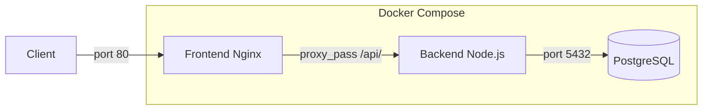

# VitalSync - Suivi médical et sportif

## Description

Application de suivi médical et sportif composée d'un backend Node.js/Express, d'un frontend servi par Nginx, et d'une base de données PostgreSQL. Ce projet met en place une chaîne CI/CD complète avec Docker et GitHub Actions.

## Architecture



## Prérequis

- Docker et Docker Compose
- Node.js 20 (pour le développement local)
- Git

## Lancement avec Docker Compose

```bash
# Copier le fichier d'environnement
cp .env.example .env

# Lancer les 3 services
docker compose up -d --build

# Vérifier que tout tourne
docker compose ps

# Arrêter les services
docker compose down
```

## Pipeline CI/CD

La pipeline GitHub Actions comporte 3 étapes :

1. **Lint & Tests** : installation des dépendances, ESLint, tests Jest
2. **Build & Push** : construction des images Docker, push vers GHCR avec tag SHA du commit
3. **Deploy staging** : déploiement via docker-compose, health check sur /health

La pipeline se déclenche sur :
- Push sur la branche `develop`
- Pull Request vers `main`

## Choix techniques

- **Node.js/Express** : léger et adapté aux API REST, large écosystème
- **Nginx** : serveur web performant, facilite le reverse proxy vers le backend
- **PostgreSQL** : base de données relationnelle robuste et open source
- **Docker** : conteneurisation pour la reproductibilité des environnements
- **GitHub Actions** : intégré à GitHub, gratuit pour les repos publics
- **GHCR** : registry d'images intégré à GitHub, pas besoin de compte Docker Hub séparé

## Structure du projet

```
vitalsync/
├── backend/
│   ├── server.js
│   ├── package.json
│   ├── Dockerfile
│   ├── .dockerignore
│   ├── .eslintrc.json
│   └── test/
│       └── health.test.js
├── frontend/
│   ├── index.html
│   ├── Dockerfile
│   └── nginx.conf
├── k8s/
│   ├── backend-deployment.yml
│   ├── backend-service.yml
│   ├── frontend-service.yml
│   └── db-secret.yml
├── .github/
│   └── workflows/
│       └── ci.yml
├── docker-compose.yml
├── .env.example
├── .gitignore
└── README.md
```

